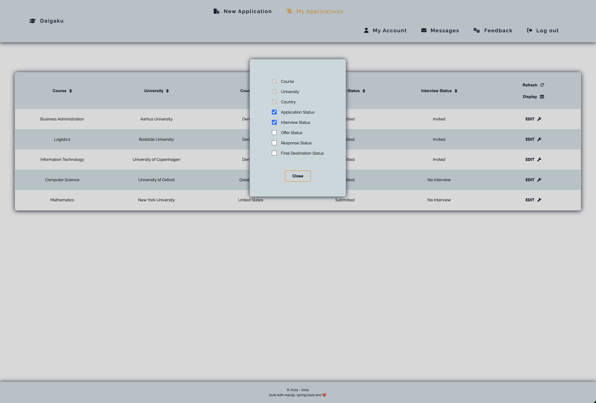

## -- Daigaku --

### Table of Contents
+ I. Project description
+ II. Techstack
+ III. Running the application
+ IV. Roadmap
+ V. Sneak peak


### I. Project Description
+ The application follows the university application process of high school students and handles complex student-mentor-admin relationships.
+ Upon registering, users with ``student`` access are able to join an institution (i.e. their school) and have a ``mentor`` user assigned to them.
+ Users with ``mentor`` permission are able to access all applications submitted by their allocated students and perform various aggregate operations.
+ Users with ``institution admin`` permission receive admin rights for their institution (e.g. accept incoming student registration requests or access detailed aggregate reports), while ``system admins`` have application-wide rights and data overview.
+ A currently work-in-progress application with new features being continuously developed and added.


### II. Techstack
```
Frontend
    + ReactJS (Vite template)               - javascript library and build tool.
    + Typescript                            - javascript extension.
    + React Router                          - client-side routing solution.
    + React Query                           - data fetching and server state manager solution.
    + React Hook Form                       - form managing library.
    + Styled Components                     - css-in-javascript styling solution.
    + Fontawesome                           - icon library.
    + Axios                                 - http client.
```

```
Backend
    + Java Spring Boot                      - java framework.
    + Spring Data JPA / Hibernate ORM       - persistence application layer.
    + Spring Security                       - authentication and access-control layer.
    + JWT                                   - authentication token solution.
    + Jakarta Validation                    - annotation-based validation library.
    + Spring Mail                           - email sending library.
    + RabbitMQ                              - message broker solution.
```

```
Database
    + PostgreSQL                            - relational database management system.
    + Redis                                 - cache storage solution.
    + AWS S3                                - file storage solution.
```

```
DevOps
    + Docker                                - containerisation solution.
```

```
Tools
    + Postman                               - API testing.
    + RabbitMQ Management UI                - RabbitMQ management and monitoring tool.
```

### III. Running the application
+ Have [Docker](https://docs.docker.com/get-docker/) installed on your local machine.
+ Clone the repository.
+ In a terminal panel, stand in the project root:
    + run ``bash setup-variables.sh`` to generate the environment fields. Follow the directions of the script.
    + run ``bash setup-containers.sh`` to build the project and set up the containarised Docker environment.
    + run ``http://localhost/`` in a browser window.
+ On the application's login page you may log in with the following credentials:
    + account with student role:
        + email - ``student@test.net``;
        + password - ``1``.


### IV. Roadmap
student user features:
- [x] submit a new application.
- [x] view aggregate application data in a table format.
- [x] edit invidivual applications.
- [x] request application deletion.
- [ ] friend request feature to be able to see each others' applications.
- [x] download application data in .pdf format.

mentor user features:
- [ ] view/edit assigned students' applications.
- [ ] submit application instead of a student.
- [ ] download assigned students' applications data in .pdf format.

institution-admin user features:
- [ ] view/edit/delete all mentors within their institution.
- [ ] view/edit/delete all students within their institution.
- [ ] accept/refuse incoming institution student/mentor join requests.
- [ ] delete applications requests.
- [ ] promote/demote mentors to institution-admin role.
- [ ] download institution-wide application data in .pdf format.

system-admin user features:
- [ ] view/edit/delete all institutions.
- [ ] view/edit/delete all institutions-admins.
- [ ] view/edit/delete all mentors.
- [ ] view/edit/delete all students.
- [ ] access / download global data reports.

application-wide features:
- [x] login/registration functionality.
- [x] comment section under individual applications.
- [ ] editable profile page.
- [ ] revamp / make the frontend design more lively.
- [ ] user in-app messaging system.
- [ ] various system-related forms (feedback, university request, etc.).

testing:
- [on-going] unit tests.
- [on-going] integration tests.

devops features:
- [x] containerisation.
- [x] github CI/CD.
- [ ] deployment.


### V. Sneak peak




