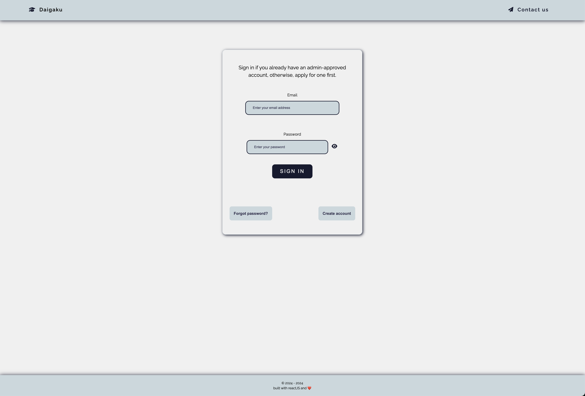
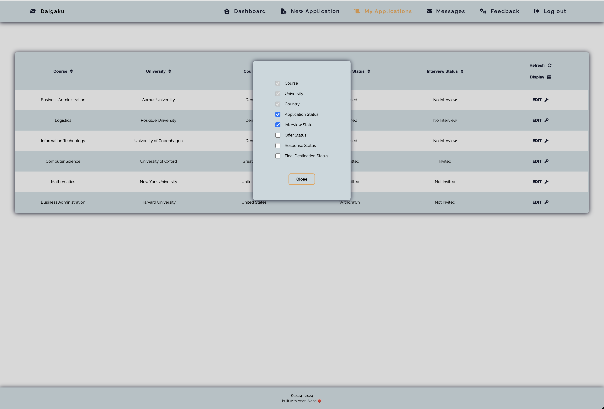
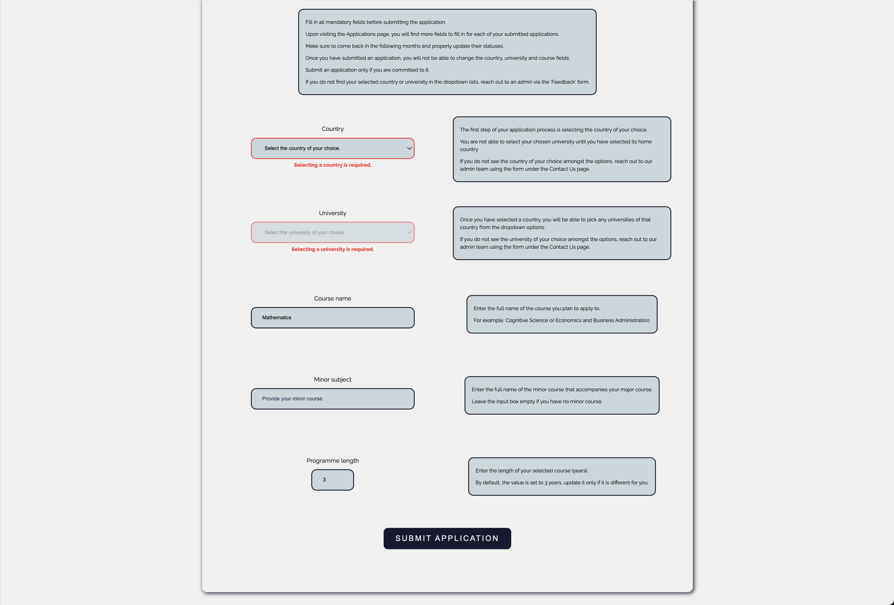

## -- Daigaku v0.1 --

### Project Description
+ The application follows the university application statuses of students and handles complex student-mentor relationships.
+ It has three types of users: student, mentor, and admin that have different permissions set.


### Techstack
```
Frontend
    + ReactJS (Vite template)          - javascript library and build tool.
    + Typescript                       - javascript extension.
    + React Router                     - client-side routing solution.
    + React Query                      - data fetching and server state manager solution.
    + React Hook Form                  - library for managing forms.
    + Styled Components                - css-in-javascript styling solution.
    + Fontawesome                      - icon library.
    + Axios                            - http client.
```

```
Backend
    + Java Spring Boot                 - java framework.
    + Spring Data JPA / Hibernate      - persistence application layer.
    + Spring Security                  - authentication and access-control layer.
    + Spring Mail                      - email sending library.
    + JWT                              - token solution.
```

```
Database
    + PostgreSQL                       - relational database management system.
```


### Sneak peak







### Running the application
+ 