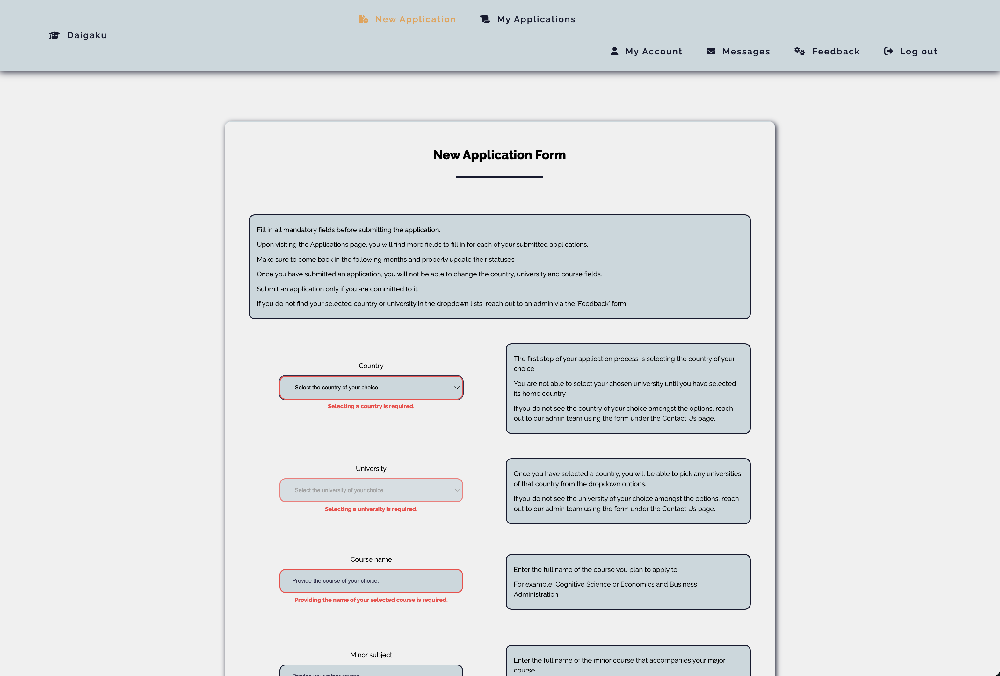

## -- Daigaku --

### Table of Contents
I. Project Description
II. Techstack
III. Running the application
IV. Roadmap
V. Sneak peak


### I. Project Description
+ The application follows the university application statuses of high school students and handles complex student-mentor relationships.
+ Upon registering, users with ``student`` access are able to join an institution (i.e. their school) and have a ``mentor`` user assigned to them who reviews their applications.
+ Users with ``institution admin`` permissions handle admin stuff for their institutions (e.g. accept incoming student registration requests or access reports), while ``system admins`` have application-wide rights and overview.


### II. Techstack
```
Frontend
    + ReactJS (Vite template)          - javascript library and build tool.
    + Typescript                       - javascript extension.
    + React Router                     - client-side routing solution.
    + React Query                      - data fetching and server state manager solution.
    + React Hook Form                  - form managing library.
    + Styled Components                - css-in-javascript styling solution.
    + Fontawesome                      - icon library.
    + Axios                            - http client.
```

```
Backend
    + Java Spring Boot                 - java framework.
    + Spring Data JPA / Hibernate      - persistence application layer.
    + Spring Security                  - authentication and access-control layer.
    + Spring Mail                      - email sending library.
    + JWT                              - token solution.
```

```
Database
    + PostgreSQL                       - relational database management system.
```


### III. Running the application
+


### IV. Roadmap
+ ``student`` user features:
- [x] submit a new application.
- [x] view aggregate application data.
- [x] edit an application.
- [ ] request application deletion.
- [ ] download application data in pdf.

+ ``mentor`` user features:
- [ ] view assigned students' applications.
- [ ] download assigned students' applications data in pdf.

+ ``institution-admin`` user features:
- [ ] view/edit/delete all mentors within institution.
- [ ] view/edit/delete all students within institution.
- [ ] accept/refuse incoming institution join requests.
- [ ] delete applications requested by students.
- [ ] download institution-wide application data in pdf.
- [ ] promote/demote mentors to institution-admin permission.

+ ``system-admin`` user features:
- [ ] view/edit/delete all institutions.
- [ ] view/edit/delete all institutions-admins.
- [ ] view/edit/delete all mentors.
- [ ] view/edit/delete all students.
- [ ] access to global data report.

+ application-wide features:
- [x] login/register functionality.
- [ ] profile page.
- [ ] revamp navbar menu bar and split it into a nav/sidebar navigation solution.
- [ ] revamp / make the frontend design more lively.
- [ ] in-app messaging system.
- [ ] feedback form.

+ devops features:
- [ ] containerisation.
- [ ] deployment.
- [ ] github CI/CD.


### V. Sneak peak


