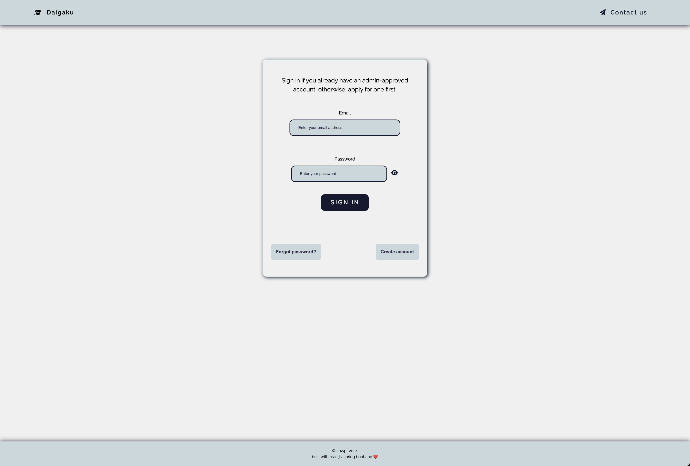

## -- Daigaku --

### Table of Contents

- I. Project Description
- II. Tech stack
- III. Sneak Peak

### I. Project Description

- The application follows the university application process of high school students and handles complex
  student-mentor-admin relationships.
- A currently work-in-progress learning/self-teaching-project application with new features being continuously developed and added.

### II. Tech stack

```
Frontend
    + ReactJS (Vite template) with Typescript   - javascript library and build tool.
    + React Router                              - client-side routing solution.
    + Tanstack Query                            - data fetching and server state manager solution.
    + React Hook Form                           - form managing library.
    + Zod                                       - schema validation tool.
    + Tailwind                                  - css styling solution.
    + Fontawesome                               - icon library.
    + Axios                                     - http client.
    + ESLint                                    - static code analysis tool.
    + Prettier                                  - code formatter tool.
```

```
Backend
    + Spring Boot                               - java framework.
    + Spring Security                           - authentication and access-control layer.
    + JWT                                       - authentication token solution.
    + Spring Data JPA / Hibernate ORM           - persistence application layer.
    + Jakarta Validation                        - annotation-based validation library.
    + Spring Mail                               - email sending library.
    + RabbitMQ                                  - message broker solution.
    + CheckStyle                                - static code analysis tool.
```

```
Testing
    + Playwright                                - end-to-end testing library.
    + JUnit, Mockito                            - backend testing libraries.
    + Postman                                   - api testing tool.
```

```
Database
    + PostgreSQL                                - relational database management system.
    + Redis                                     - cache storage solution.
    + AWS S3                                    - file storage solution.
```

```
DevOps
    + Docker                                    - containerisation solution.
    + Github Actions                            - automated test running tool.
```

```
Tools
    + RabbitMQ Management UI                    - management and monitoring tool.
```

### III. Sneak Peak




